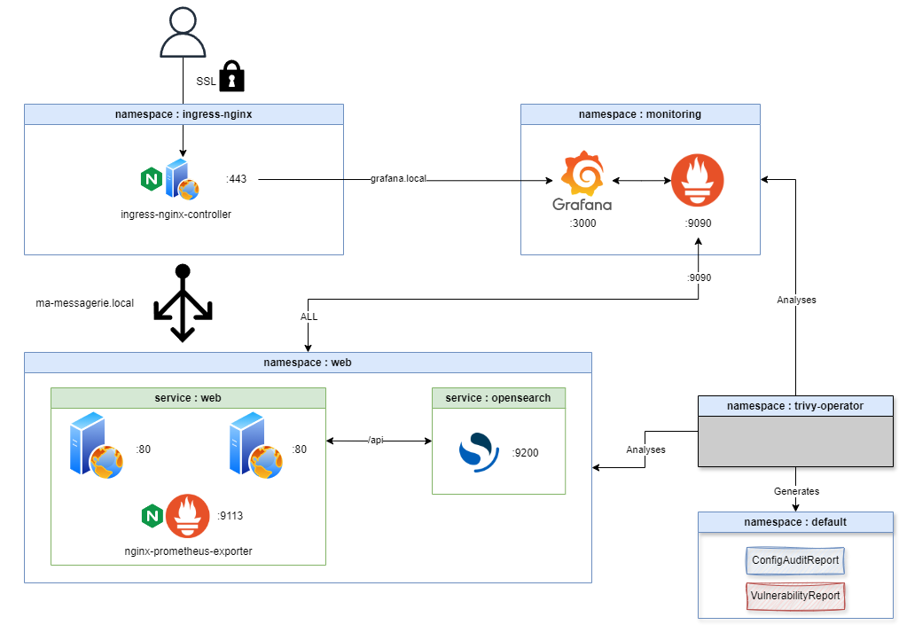

# Simple Chat Web App with Kubernetes Infrastructure

## Overview

This project is a simple chat web application that allows users to send and view messages in real-time. It is built using a combination of Nginx, OpenSearch, Prometheus, and Grafana for monitoring. The application is containerized using Docker and orchestrated with Kubernetes.



## Features

- Real-time message sending and receiving
- Monitoring with Prometheus and Grafana

## Prerequisites

- Ensure that `grafana.local` and `ma-messagerie.local` are added to your `/etc/hosts` file to access the services locally.

## Kubernetes Configuration

The `k8s` directory contains all the necessary Kubernetes configuration files:

- **Deployments**: 
  - `grafana-deployment.yaml`
  - `web-deployment.yaml`
  - `opensearch-deployment.yaml`
  - `prometheus-deployment.yaml`

- **Services**:
  - `grafana-service.yaml`
  - `prometheus-service.yaml`

- **Ingress**:
  - `grafana-ingress.yaml`
  - `web-ingress.yml`

- **TLS Certificates**: self-signed certificates generated at runtime
  - `tls-grafana.crt`, `tls-grafana.key`
  - `tls-web.crt`, `tls-web.key`

## Setup

1. **Clone the repository:**

   ```bash
   git clone https://github.com/c-adrien/simple-chat-web-app-infrastructure.git
   cd simple-chat-web-app-infrastructure
   ```

2. Ensure you have the following environment variables set in your shell or in a .env file:

   ```bash
   export DOCKERHUB_USERNAME=your_dockerhub_username
   export OPENSEARCH_PASSWORD=$(echo -n "your_opensearch_password" | base64)
   export GF_SECURITY_ADMIN_PASSWORD=your_grafana_admin_password
   ```

3. **Run the setup script:**

   ```bash
   cd k8s
   ./setup.sh
   ```

   This script will deploy all the necessary components to your Kubernetes cluster.
   Use the `--trivy` flag to enable trivy-operator.

## Usage

- Access the web application at `https://ma-messagerie.local`.
- Use the form to send messages and view them in the timeline.
- Access Grafana for monitoring at `https://grafana.local`.

## Monitoring

- **Prometheus** is available at `https://prometheus.local`.
- **Grafana** dashboards can be accessed at `https://grafana.local`.

## Security

- Ensure that your TLS certificates are properly configured and secured.
- Review the trivy audit reports for any potential security issues.

## Accessing internal services

Enable port-forwarding to access internal services:

- `kubectl port-forward service/prometheus 9090:9090 -n monitoring`
- `kubectl port-forward service/opensearch 9200:9200 -n web`

## Contributing

Contributions are welcome! Please fork the repository and submit a pull request for any improvements or bug fixes.

## License

This project is licensed under the MIT License. See the [LICENSE](LICENSE) file for more details.